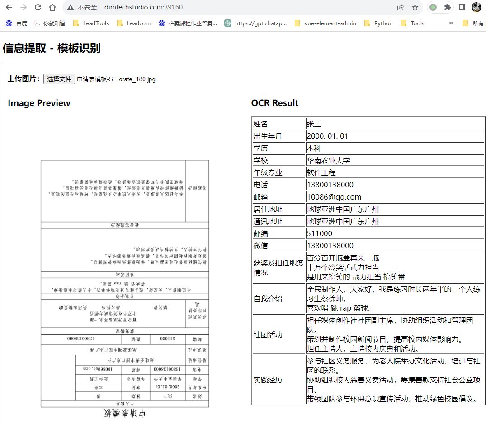

  

# 人工智能结合模板实现表格信息提取  

## 一、 项目介绍  
本项目基于是OCR（文本识别）、表格识别的人工智能技术应用，通过表格识别，实现快速制作模板；模板单元格信息，结合OCR识别结果，将表格内容提取为结构化信息输出。与KIE（Key Information Extraction，关键信息抽取）模型对比，本项目准确率更高，效率更快，占用资源更小，能大大提升用户将非结构化的数据转化为结构化数据的质量。  

## 二、技术要点  
* PaddleOCR，百度飞桨开源的OCR文字识别工具库  
* Table Detection，基于Cycle-CenterNet的表格识别  
* OpenCV，开源、跨平台的计算机视觉库  

## 三、视频展示  
<iframe src="https://player.bilibili.com/player.html?aid=961068710&bvid=BV1fH4y1U7g2&cid=1268191769&p=1" scrolling="no" border="0" frameborder="no" framespacing="0" allowfullscreen="true" width="640" height="360"> </iframe>  

## 四、操作流程  
### 制作模板  
* 运行模板制作工具WlkrLabel  
* 文件 -> 打开，选择模板所在路径文件夹  
  
* 人工智能 -> 表格检测  
    * Anchor锚点，用于定位表格，修正图片偏移，适用于如扫描件、照片等，减少因图片位置偏移带来的错误  
    * 单元格Region，适合文字居中的情况  
    * 文字Region，适合文字非居中的情况  
  
* 选中的蓝色单元，为程序推理得出的锚点，其他颜色单元格则为与锚点一一配对的待提取内容  
  
* 检查模板，由于无法做到100%准确，需要手动修正，如删除多余单元格，修正错误字等  
  
* 确认模板无误后，点击右下角“确认”按钮  
  
* 对于空白表单也能识别，但是效果会稍差  
  
* 完成所有图片模板的制作后，按Ctrl + S保存结果（或者 文件 -> 导出标记结果）  
  
### 上传模板  
* 使用系统api接口更新模板，  
* 选中模板文件夹内的Label.txt及相关图片  
* 将所有文件上传到系统。  
  
### 测试效果  
* 试用地址：[表格信息提取 - 模板识别](http://dimtechstudio.com:39160/)  
* 试用地址中提供了两种方式测试  
* 一是下载Excel，自行填充内容，导出图片后，旋转角度测试  
* 二是直接下载0°与180°两张示例图，用于测试  
  
* 下面为旋转180°的识别效果  
  
