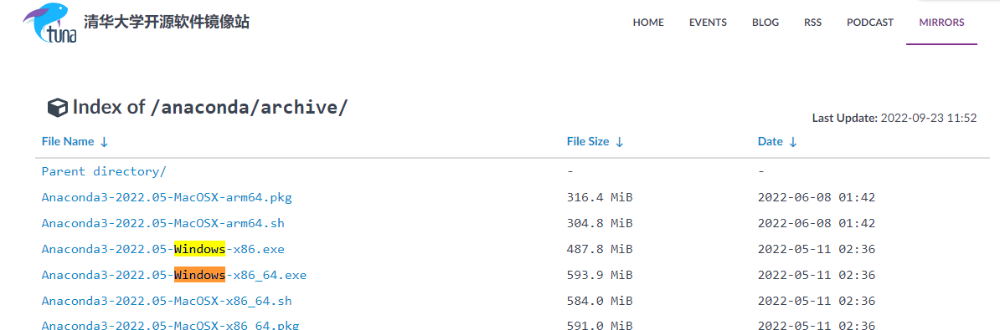
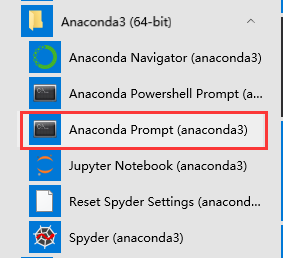

# PPOCRLabel使用说明
## 安装说明
### 运行环境
按理Windows、Linux，MacOS等图形化操作系统均支持，建议安装anaconda3这类python虚拟环境软件，保持环境干净性以免弄坏。
下面教程将以Windows为例，演示如何安装。

### 安装Anaconda3
从[Anaconda3 清华镜安装包下载列表](https://mirrors.tuna.tsinghua.edu.cn/anaconda/archive/?C=M&O=D)中找到你所需要的版本。笔者以[Anaconda3-2022.05-Windows-x86_64.exe](https://mirrors.tuna.tsinghua.edu.cn/anaconda/archive/Anaconda3-2022.05-Windows-x86_64.exe)为例

选好安装路径，一直点下一步即可
### 新建Python虚拟环境
安装完毕后，在开始菜单里，找到Anaconda3(64-bit) -> Anaconda Prompt(anaconda3)

在anaconda3的cmd窗口中输入命令，创建虚拟环境
```bash
conda create --name paddle_env python=3.8 --channel https://mirrors.tuna.tsinghua.edu.cn/anaconda/pkgs/free/
```
<mark>todo: 补充截图</mark>

安装PPOCRLabel


### 安装PPOCRLabel

```
# 安装CPU版paddlepaddle
python -m pip install paddlepaddle -i https://mirror.baidu.com/pypi/simple

# 安装PPOCRLabel
pip install PPOCRLabel
```