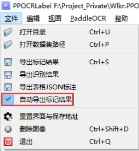

# PPOCRLabel使用说明
## 安装说明
### 运行环境
理论上Windows、Linux，MacOS等图形化操作系统均支持，建议安装anaconda3这类python虚拟环境软件，保持环境干净性以免弄坏。
下面教程将以Windows为例，演示如何安装。

### 安装Anaconda3
从[Anaconda3 清华镜安装包下载列表](https://mirrors.tuna.tsinghua.edu.cn/anaconda/archive/?C=M&O=D)中找到你所需要的版本。笔者以[Anaconda3-2022.05-Windows-x86_64.exe](https://mirrors.tuna.tsinghua.edu.cn/anaconda/archive/Anaconda3-2022.05-Windows-x86_64.exe)为例

选好安装路径，一直点下一步即可。

### 新建Python虚拟环境
* 安装完毕后，在开始菜单里，找到Anaconda3(64-bit) -> Anaconda Prompt(anaconda3)

* 在anaconda3的cmd窗口中输入命令，创建paddlepaddle虚拟环境  
<mark>默认是命名为base的虚拟机环境，你也可以不执行create命令，直接使用base环境。</mark>
```bash
conda create --name paddle_env python=3.8 --channel https://mirrors.tuna.tsinghua.edu.cn/anaconda/pkgs/free/
```

* 创建后，输入命令切换需虚拟环境  
<mark>注意，如果你不是以默认的base环境安装时，则每次重新打开anaconda3 prompt后，需要执行此命令切换</mark>
```bash
conda activate paddle_env
```

* 执行成功后，可以看到环境从base变为paddle_env

### 安装PPOCRLabel
* 同样是在anaconda3的cmd窗口运行
```bash
#安装CPU版paddlepaddle
python -m pip install paddlepaddle -i https://mirror.baidu.com/pypi/simple

#安装PPOCRLabel
pip install PPOCRLabel
```

* 输入以下命令启动PPOCRLabel，注意启动参数是必须的
```bash
#启动 【KIE 模式】
PPOCRLabel --lang ch --kie True  
```
* 启动成功时如下图

## PPOCRLabel操作说明
### 新建模板
* 新建文件夹并命名为Template，把你所需要制作为模板的图片放进去，并重命名为模板名。  
<mark>注意不能路径不能有中文、空格等字符，否则PPOCRLabel无法正常运行。</mark>
如下图示例


* 文件 -> 打开目录


* 找到Template文件夹，打开

* 再打开自动导出标记结果，此选项是每确认5张图片保存一次。


### 标注模板
#### 半自动标注
* 首次进入可以在工具栏上， PaddleOCR -> 自动标注，标注出所有图片上的位置和文字。
* 后续对着文本框，右键，更改box关键字类别或按快捷点Ctrl + X。
* 半自动标注可能会多出很多于你而言没用的文本标注框，可以手动删除或按照手动标注的操作执行

#### 手动标注
* 在图片上按右键，选择矩形标注或按快捷键W。
* 先输入box关键字类别，然后按Ctrl + R使用OCR识别文字，或点击程序右则，手动输入文字。

#### 标注关键字
* 关键字分为两部分，一个是锚点（anchors，名称固定不能表更）,一分部是目标（targets，内容可变，如姓名、性别等）
##### 设置锚点（anchors）
* 锚点设置，其必须是位置固定且值不变的文字，必须设置4个以上，同时尽量分布在4个角上。
* 如下图《员工入职表》的{姓名，出生年月，联系电话、通讯地址，自我评价}
##### 设置目标（targets）
* 标注你需要提取的信息字段，如姓名-张三，性别-男等。
* 确保右则没有区域没有待识别的文本框
* 点击右下角的确定
* 按Ctrl + S 保存标注
* 关闭PPOCRLabel


* 将Template文件夹打包为zip文件，上传图Wlkr.PPOCR
<mark>TODO：开发Upload</mark>